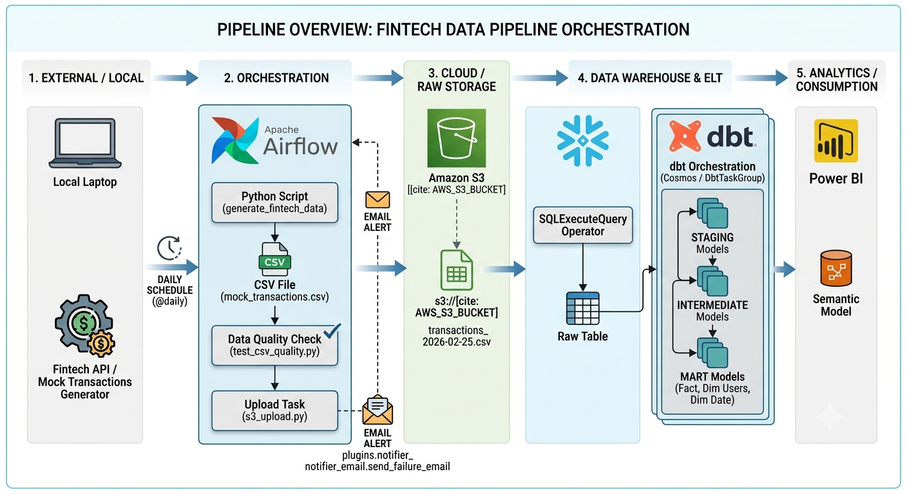
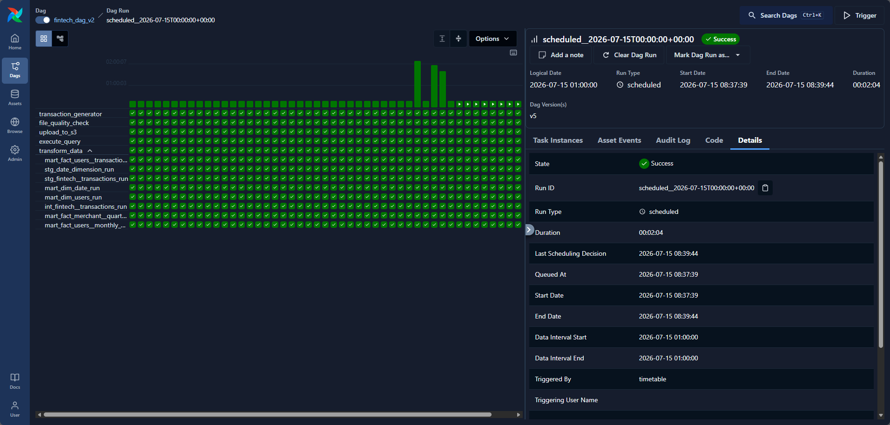
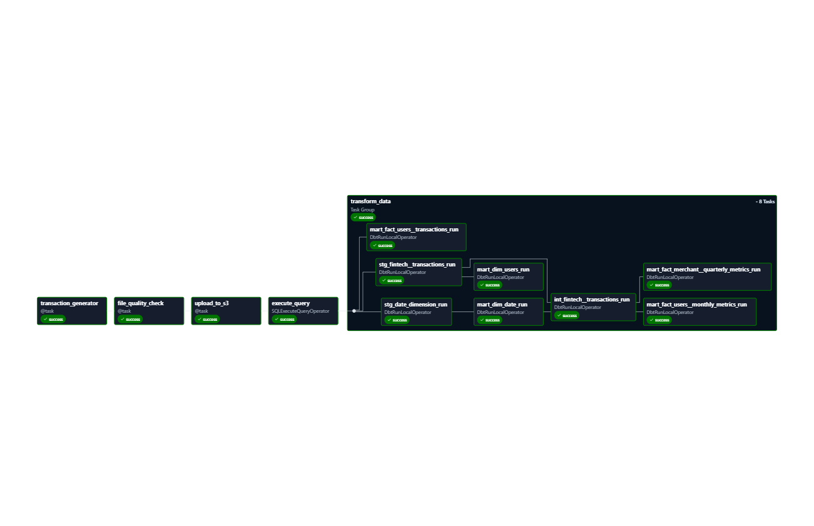
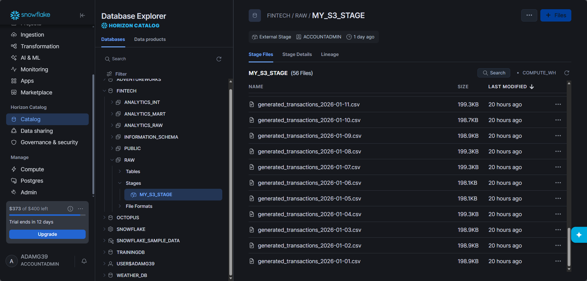
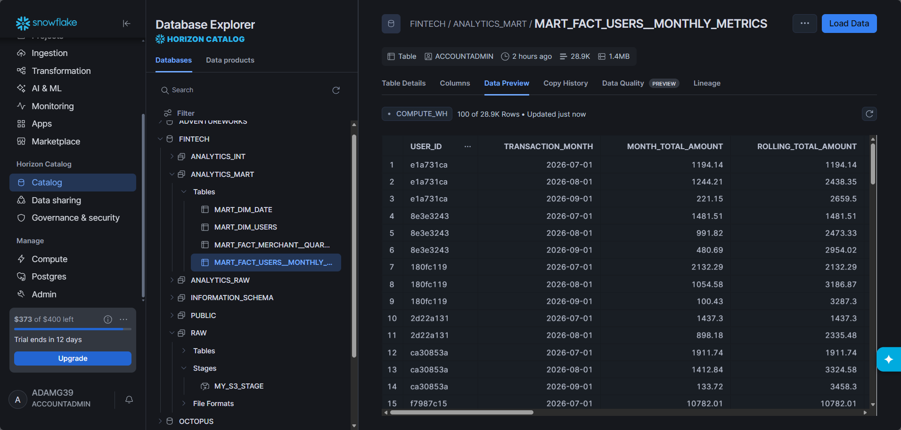

# Portfolio-Fintech

---

# Pipeline Introduction
This pipeline aims to mimic a real-world example of ETL/ELT processing raw transactional data from a financial system to managed cloud data storage, and finally to business end users via a modern analytics warehouse. 

This project forms part of a portfolio example pipelines collection.

## ⚠️ Limitations
For simplicity, some Dimensions (such as `mart_dim_users`) are extracted dynamically from the raw transactional Fact data. In a real-world enterprise pipeline, these dimensions would be extracted directly from source master-data system tables (such as CRM or production database user tables) to capture users who have registered but not yet transacted.

---

## 🛣️ Pipeline Architecture

---

## 🎛️ Orchestration
Apache Airflow manages the end-to-end orchestration of all activities, ensuring secure execution, pipeline order, and data quality.

### Key Pipeline Tasks:
- **Data Generation:** Generates mock transactional company data on a daily schedule.
- **Pre-Load Data Quality Gate:** Validates the raw local CSV file structure, schemas, and data types using Pandas prior to cloud transfer.
- **Lake Ingestion:** Securely uploads validated CSV files to AWS S3.
- **Warehouse Loading:** Automatically executes Snowflake COPY commands to ingest S3 stage data into raw tables.
- **ELT Transformations (dbt):** Executes layered SQL models (Staging $\rightarrow$ Intermediate $\rightarrow$ Marts) directly inside Snowflake.

### Pipeline Features:
- **Pandas-based Pre-load Validation:** Custom python validation gating schema matching, non-null checks, type conversions, and domain validation.
- **SMTP Notification System:** A modular, reusable plugin (`notifier_email.py`) leveraging the modern Airflow `SmtpNotifier` to alert administrators immediately upon DAG task failures.
- **Sequential Execution & Safety:** Configured with `depends_on_past=True` and structured dbt testing to prevent historical pipeline runs from executing out-of-order or corrupting states.

### Orchestration UI Logs:

---

## 💽 Warehouse Compute & Modeling
AWS S3 is integrated with Snowflake using an external stage pipeline, allowing structured, secure, and rapid data copies:

### dbt Modeling Structure:
1. **Staging (`stg_`)**: Standardizes raw field names, casts timestamp strings into actual date-times, and strips noise.
2. **Intermediate (`int_`)**: Evaluates fintech compliance metrics (such as checking transactions for potential cash-structuring patterns or dividing discretionary vs. non-discretionary spending).
3. **Marts (`mart_`)**: Models data into high-performance dimensional star schemas (such as calculating rolling 3-month standard deviation volatility per user, or tracking quarterly merchant rank-change deltas).

Preview of an analytics-ready mart table populated in Snowflake:

